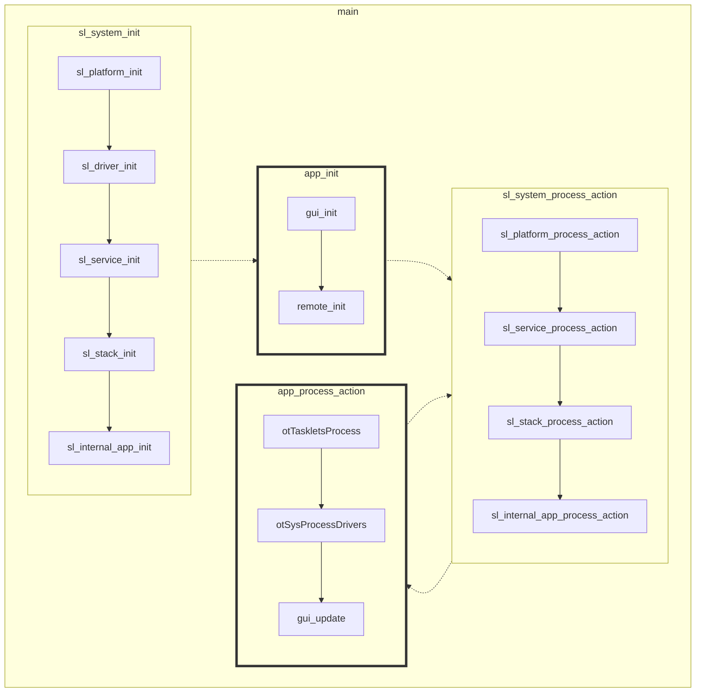
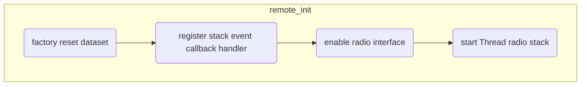
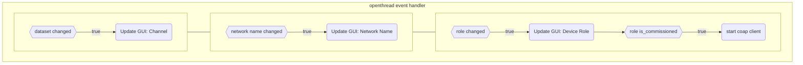

# OpenClicker Remote

## Introduction

OpenClicker Remote is a standalone Constrained Application Protocol (CoAP) client example running the OpenThread (OT) stack on EFR32.

> This project is designed to be used in tandem with one device running the [OpenClicker Base Station](https://github.com/silabs-nino/openclicker_basestation) project.

The project serves to demonstrate how to develop applications on top of the OT stack and covers the following concepts:

- Joining a Thread network through a pre-shared key (pSKD)
- Initializing a CoAP client
- Processing network events
- Sending CoAP requests

OT prioritizes network stability over network hierarchy and thus there is no explicit mechanism available to make a device assume a specific role or type (e.g. router, ED, leader, etc.). For this reason the network could be assembled in any manner, wherein the "base station" need not be the network leader (unlike STAR network topology). Figure 1.1 and Figure 1.2 depict different possible network arrangements.

```
┌────────────────────────────────────────────────────────────────────────┐
│                                                                        │
│            ┌ ─ ─ ─ ─                           ┌ ─ ─ ─ ─               │
│              remote │◀┐                          remote │              │
│            └ ─ ─ ─ ─  └─┐                      └ ─ ─ ─ ─               │
│                         └─┐                    ▲                       │
│                           └─┐                 ┌┘                       │
│                             ▼                 ▼                        │
│                        ┏━━━━━━━━┓    ┏━━━━━━━━┓           ┌ ─ ─ ─ ─    │
│                        ┃ remote ┃◀──▶┃ remote ┃◀─────────▶  remote │   │
│ ┌ ─ ─ ─ ─              ┗━━━━━━━━┛    ┗━━━━━━━━┛           └ ─ ─ ─ ─    │
│   remote │◀┐           ▲                      ▲                        │
│ └ ─ ─ ─ ─  └─┐        ┌┘                      └┐                       │
│              ▼        ▼                        ▼                       │
│              ┏━━━━━━━━┓                        ┏━━━━━━━━┓              │
│              ┃ remote ┃                        ┃ remote ┃              │
│              ┗━━━━━━━━┛                        ┗━━━━━━━━┛              │
│              ▲        ▲                        ▲        ▲              │
│ ┌ ─ ─ ─ ─  ┌─┘        └┐                      ┌┘        └┐             │
│   remote │◀┘           ▼                      ▼          │             │
│ └ ─ ─ ─ ─              ┏━━━━━━━━━━━━━━━━━━━━━━┓          └┐ ┌ ─ ─ ─ ─  │
│                        ┃     Base Station     ┃           └▶  remote │ │
│                        ┗━━━━━━━━━━━━━━━━━━━━━━┛             └ ─ ─ ─ ─  │
│                        ▲                      ▲                        │
│                       ┌┘                      └┐                       │
│                       ▼                        ▼                       │
│              ┌ ─ ─ ─ ─                         ┌ ─ ─ ─ ─               │
│                remote │                          remote │              │
│              └ ─ ─ ─ ─                         └ ─ ─ ─ ─               │
│                                                                        │
│                                       ┌──────────────────────────────┐ │
│                                       │legend                        │ │
│                                       │┏━━━━━━━━━━━━┓ ┌ ─ ─ ─ ─ ─ ─  │ │
│                                       │┃   router   ┃   end device │ │ │
│                                       │┗━━━━━━━━━━━━┛ └ ─ ─ ─ ─ ─ ─  │ │
│                                       └──────────────────────────────┘ │
│                                                                        │
│                Figure 1.1: OpenThread Network Topology                 │
└────────────────────────────────────────────────────────────────────────┘
```

```
┌────────────────────────────────────────────────────────────────────────┐
│                                                                        │
│            ┌ ─ ─ ─ ─                           ┌ ─ ─ ─ ─               │
│              remote │◀┐                          remote │              │
│            └ ─ ─ ─ ─  └─┐                      └ ─ ─ ─ ─               │
│                         └─┐                    ▲                       │
│                           └─┐                 ┌┘                       │
│                             ▼                 ▼                        │
│                        ┏━━━━━━━━┓    ┏━━━━━━━━┓           ┌ ─ ─ ─ ─    │
│                        ┃ remote ┃◀──▶┃ remote ┃◀─────────▶  remote │   │
│ ┌ ─ ─ ─ ─              ┗━━━━━━━━┛    ┗━━━━━━━━┛           └ ─ ─ ─ ─    │
│   remote │◀┐           ▲                      ▲                        │
│ └ ─ ─ ─ ─  └─┐        ┌┘                      └┐                       │
│              ▼        ▼                        ▼                       │
│              ┏━━━━━━━━┓                        ┏━━━━━━━━┓              │
│              ┃ remote ┃                        ┃ remote ┃              │
│              ┗━━━━━━━━┛◀┐                    ┌▶┗━━━━━━━━┛              │
│              ▲          └─┐                ┌─┘          ▲              │
│ ┌ ─ ─ ─ ─  ┌─┘            └─┐            ┌─┘            └┐             │
│   remote │◀┘                └▶┏━━━━━━━━┓◀┘               │             │
│ └ ─ ─ ─ ─                     ┃ remote ┃                 └┐ ┌ ─ ─ ─ ─  │
│                               ┗━━━━━━━━┛                  └▶  remote │ │
│                               ▲        ▲                    └ ─ ─ ─ ─  │
│                              ┌┘        └┐                              │
│                            ┌─┘          └─┐                            │
│                          ┌─┘              └─┐                          │
│         ┌ ─ ─ ─ ─ ─ ─ ─ ◀┘                  └▶┌ ─ ─ ─ ─                │
│           Base Station │                        remote │               │
│         └ ─ ─ ─ ─ ─ ─ ─                       └ ─ ─ ─ ─                │
│                                                                        │
│                                       ┌──────────────────────────────┐ │
│                                       │legend                        │ │
│                                       │┏━━━━━━━━━━━━┓ ┌ ─ ─ ─ ─ ─ ─  │ │
│                                       │┃   router   ┃   end device │ │ │
│                                       │┗━━━━━━━━━━━━┛ └ ─ ─ ─ ─ ─ ─  │ │
│                                       └──────────────────────────────┘ │
│                                                                        │
│         Figure 1.2: OpenThread Network Topology (Alternative)          │
└────────────────────────────────────────────────────────────────────────┘
```

For more information on Thread protocol or CoAP please refer to the following resources:

- [CoAP](https://coap.technology/)
- [OpenThread](https://openthread.io/)
- [OpenThread CoAP API's](https://openthread.io/reference/group/api-coap)

## Requirements

#### Software

- [Simplicity Studio v5.x (SSv5)](https://www.silabs.com/developers/simplicity-studio)
- [Gecko SDK (GSDK) v4.x](https://github.com/SiliconLabs/gecko_sdk)

#### Hardware

- WSTK Mainboard (BRD4001A)
- MG12 Radio Board (BRD4162A)

## Setup

1) Import the `SimplicityStudio/openclicker_remote.sls` project export into SSv5.
1) Compile and Build the project.
1) Flash the binary to the MG12
    - ensure that a bootloader is present. If not, a recommendation is the `bootloader-storage-internal-single` example project.
1) Ensure that the on-board memory LCD screen shows the project GUI.

## How It Works

The remote application runs a simple CoAP client which sends CoAP `POST` requests to update the `question/answer` resource on the Base Station CoAP server. 

The project's call graph, from a high level perspective, is show in figure [Platform Loop](#platform-loop) below. User code, which initializes the thread network and application, is contained within `app_init()` and `app_process_action`.

#### Platform Loop



On boot, the device will clear all previous network datasets (factory reset). A callback handler is registered, through the otSetStateChangedCallback() API, to process stack events such as changes to the dataset, device state, or device role.

Pressing `btn0` on the WSTK when the GUI displays: `press 'B' to join` will enable the joiner. The device will then attempt to join a thread network through the pSKD. This allows the device with knowledge of the pSKD to join the Base Station's network without needing to know the network name, channel, or authentication keys. 

The full event handler for the OpenThread stack is depicted in Figure [OpenThread Application Flow](#openthread-application-flow) below.


#### OpenThread Application Flow





### CoAP

When the device is in a commissioned state, the CoAP client is initialized. At this point the on-board buttons of the WSTK change functionality. Pressing either button will send a CoAP `POST` request to the Base Station with the message corresponding to the device's MAC Address and the letter represented in the GUI ('A' or 'B'). Since any device (in theory) could be the CoAP server with the resource `question/answer` the CoAP client is configured to send a request to the Thread Network LEADER. The IPv6 address of the LEADER is determined by the [mesh local, routing locator](https://openthread.io/guides/thread-primer/ipv6-addressing#routing-locator-rloc).


## Porting

Open the `.slcp` and in the "Overview" tab select "[Change Target/SDK](https://docs.silabs.com/simplicity-studio-5-users-guide/latest/ss-5-users-guide-developing-with-project-configurator/project-configurator#target-and-sdk-selection)". Choose the new board or part to target and "Apply" the changes.
> There may be dependencies that need to be resolved when changing the target architecture.